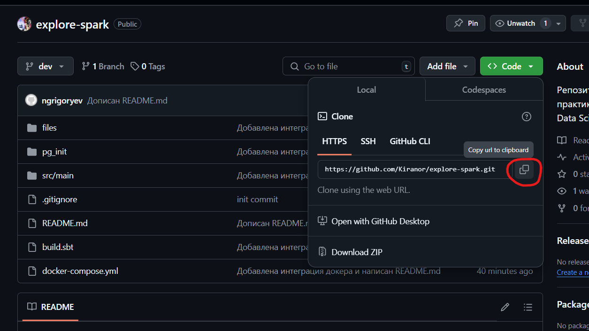
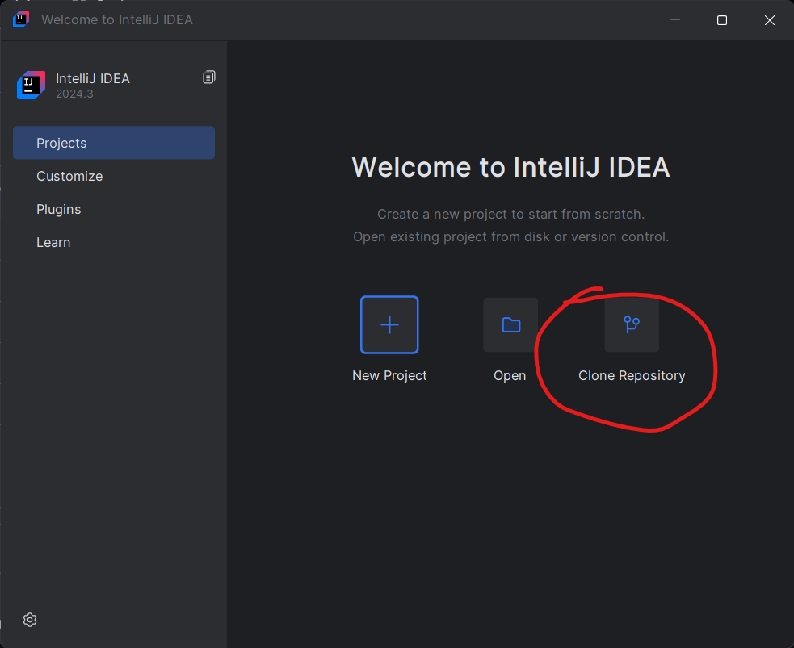
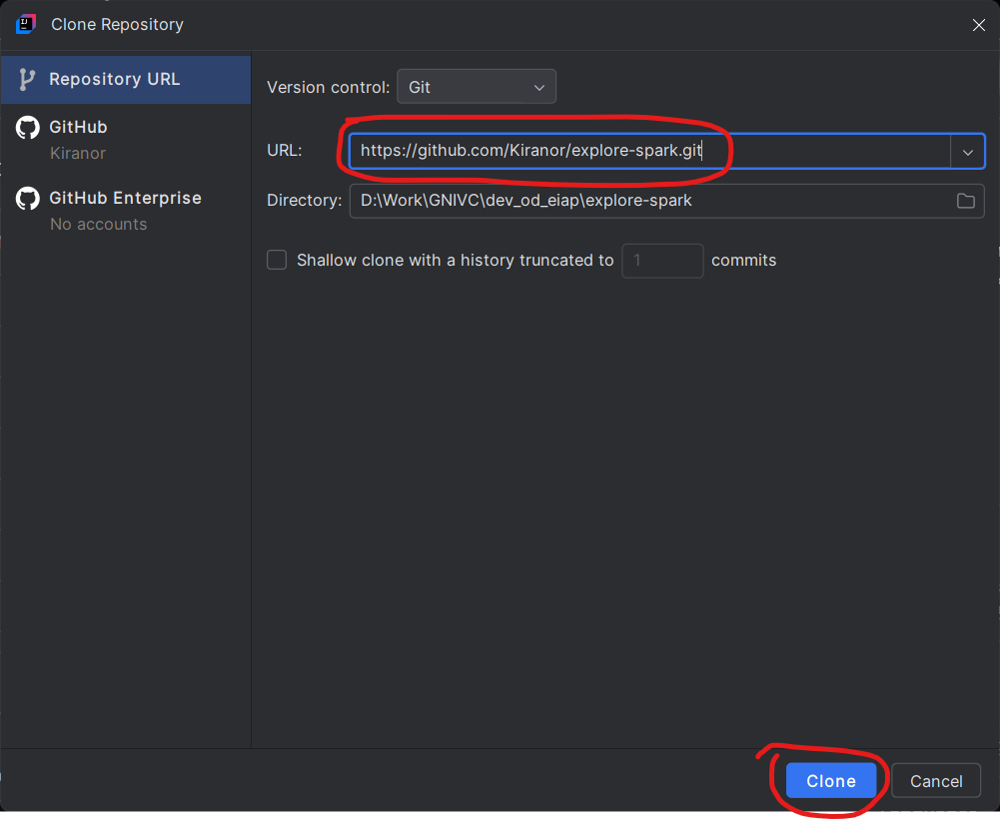
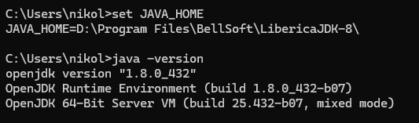
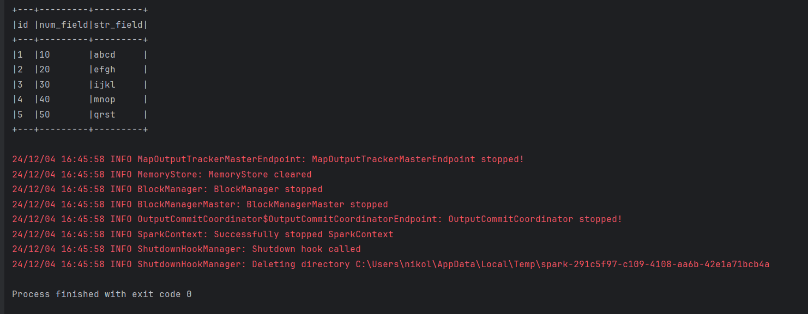
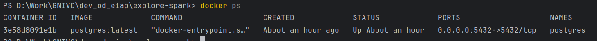
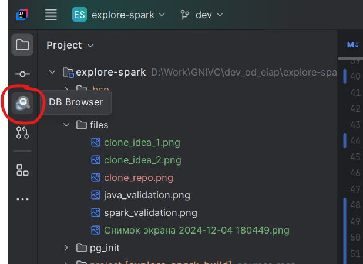
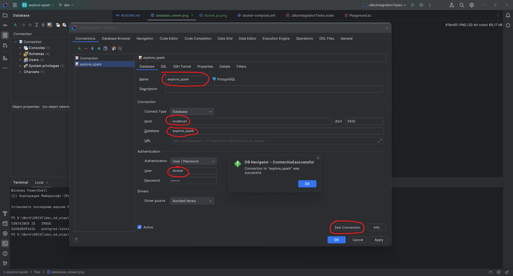
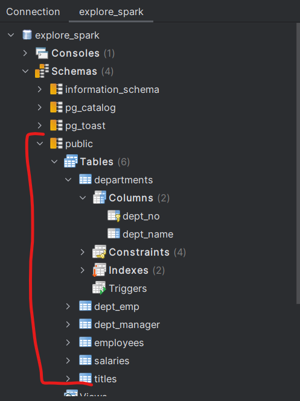
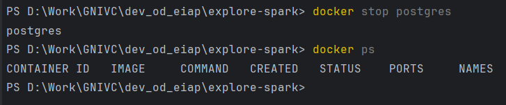

# Оглавление
<!-- TOC -->
* [Оглавление](#оглавление)
* [Установка необходимого ПО](#установка-необходимого-по)
* [Клонирование репозитория](#клонирование-репозитория)
* [Проверка работоспособности](#проверка-работоспособности)
  * [Проверка установки Java](#проверка-установки-java)
    * [Пример вывода командной строки при корректной установке:](#пример-вывода-командной-строки-при-корректной-установке)
  * [Проверка компиляции и запуска приложений](#проверка-компиляции-и-запуска-приложений)
* [Домашнее задание](#домашнее-задание)
  * [Основы работы с git](#основы-работы-с-git)
  * [Порядок выполнения заданий (от простого к сложному):](#порядок-выполнения-заданий-от-простого-к-сложному)
    * [1. `DataFrameTasks.scala`](#1-dataframetasksscala)
    * [2. `DataSourceTasks.scala`](#2-datasourcetasksscala)
    * [3. `ColumnsAndExpressionsTasks.scala`](#3-columnsandexpressionstasksscala)
    * [4. `AggregationsTasks.scala`](#4-aggregationstasksscala)
    * [5. `JoinsTasks.scala`](#5-joinstasksscala)
    * [6. `JdbcIntegrationTasks.scala`](#6-jdbcintegrationtasksscala)
      * [6.1 Подготовка docker-контейнера](#61-подготовка-docker-контейнера)
      * [6.2 Структура и связи таблиц БД](#62-структура-и-связи-таблиц-бд)
* [Устранение ошибок](#устранение-ошибок)
  * [При запуске spark-shell или кода в IDEA возникает ошибка `org.apache.spark.SparkException: Invalid Spark URL: spark://HeartbeatReceiver@HOME_PC:53176`](#при-запуске-spark-shell-или-кода-в-idea-возникает-ошибка-orgapachesparksparkexception-invalid-spark-url-sparkheartbeatreceiverhome_pc53176)
  * [Ошибка при запуске контейнера Docker](#ошибка-при-запуске-контейнера-docker)
* [Полезные ссылки](#полезные-ссылки)
<!-- TOC -->

# Установка необходимого ПО

- [Установить интегрированную среду разработки IntelliJ IDEA Community Edition](https://www.jetbrains.com/ru-ru/idea/download)
- [Установить плагин Scala](https://plugins.jetbrains.com/plugin/1347-scala)
- [Установить плагин DatabaseHelper](https://plugins.jetbrains.com/plugin/20294-databasehelper)
- [Установить Git](https://git-scm.com/downloads)
- [Установить Java Developers Kit 8 (JDK)](https://bell-sw.com/pages/downloads/#jdk-8-lts)
- [Установить Docker](https://www.docker.com/get-started/)

# Клонирование репозитория

Для начала работы с репозиторием после того как было установлено все необходимое ПО следует:

- Запустить IntelliJ IDEA Community Edition;
- Клонировать репозиторий.





# Проверка работоспособности

## Проверка установки Java

В командной строке `cmd` выполнить команды:

- `set JAVA_HOME` - проверка корректной установки переменной окружения;
- `java -version` - проверка доступности Java из командной строки.

### Пример вывода командной строки при корректной установке:



## Проверка компиляции и запуска приложений

В текущем проекте перейти в модуль `testpkg`, открыть класс `FirstTestClass` и запустить его выполнение с помощью интерфейса IDEA или комбинацией `Ctrl+Shift+F10`.

Также можно запустить это приложение прямо из текущего файла `README.md`, нажав выше на имя класса со стрелкой.

Результатом выполнения тестового приложения должен быть вывод в консоль информации, представленной на скриншоте ниже:


# Домашнее задание

## Основы работы с git

Перед началом выполнения задания необходимо создать персональную ветку репозитория в `git` для последующего упрощения решения проблем с заданиями и персональными вопросами.

1. Создать ветку можно следующим образом:

- [Через интерфейс IDE](https://www.jetbrains.com/help/idea/manage-branches.html)
- Через командную строку - для этого отройте терминал в корневой директории репозитория и выполните следующую команду:

`git checkout -b 'homework/<ФАМИЛИЯ>'`, где `<ФАМИЛИЯ>` заполнить своими значениями в транслите на английский.

Далее после выполнения заданий необходимо сделать коммит изменений и отправить свою локальную ветку в удалённый репозиторий `Github`.

2. Сделать коммит можно следующим образом:

- [Через интерфейс IDE](https://www.jetbrains.com/help/idea/commit-and-push-changes.html#commit)
- Через командную строку - для этого отройте терминал в корневой директории репозитория и выполните следующие команды:

2.1. `git add *` - добавляет все измененные файлы в коммит;

2.2 `git commit -m '<ДОП ИНФОРМАЦИЯ>'` - выполняет коммит.

3. Опубликовать ветку можно следующим образом:

- [Через интерфейс IDE](https://www.jetbrains.com/help/idea/commit-and-push-changes.html#push)
- Через командную строку - для этого отройте терминал в корневой директории репозитория и выполните следующую команду:

`git push`

После этого в удалённом репозитории `Github` в веб-интерфейсе будет доступна Ваша ветка.

При необходимости внести дополнительные изменения (добавить решение новой задачи или переписать текущее) необходимо повторить шаги 2 и 3.

## Порядок выполнения заданий (от простого к сложному):

### 1. [`DataFrameTasks.scala`](src/main/scala/tasks/DataFrameTasks.scala)

### 2. [`DataSourceTasks.scala`](src/main/scala/tasks/DataSourceTasks.scala)

### 3. [`ColumnsAndExpressionsTasks.scala`](src/main/scala/tasks/ColumnsAndExpressionsTasks.scala)

### 4. [`AggregationsTasks.scala`](src/main/scala/tasks/AggregationsTasks.scala)

### 5. [`JoinsTasks.scala`](src/main/scala/tasks/JoinsTasks.scala)

### 6. [`JdbcIntegrationTasks.scala`](src/main/scala/tasks/JdbcIntegrationTasks.scala)

#### 6.1 Подготовка docker-контейнера

В рамках данного задания предполагается интеграционное взаимодействие с сервером БД Postgres, развернутого в локальном Docker-контейнере.
Конфигурация образа находится в файле [docker-compose.yml](docker-compose.yml) и включает название контейнера, порт для подключения, а также имя пользователя и пароль для подключения.

Для запуска сервера БД в контейнере необходимо находясь в корневой директории текущего проекта в командной строке выполнить команду `docker-compose up` и дождаться завершения скачивания и развёртывания контейнера.

Для проверки успешности запуска контейнера с помощью команды `docker ps` необходимо вывести список запущенных контейнеров.
Пример запущенного контейнера БД Postgres представлен на следующем скриншоте.



Для проверки успешности создания объектов БД с помощью плагина `DatabaseHelper` необходимо подключиться к БД и посмотреть на созданные объекты.
Host - localhost, database - explore_spark, user - docker, password - docker.

Шаги для подключения представлены на скриншотах ниже.




В итоге в БД должны быть присутствовать следующие таблицы, представленные на скриншоте.



После завершения работы по заданию остановить контейнер можно с помощью команды `docker stop postgres` и убедиться, что больше нет запущенных контейнеров с помощью команды `docker ps` как показано на скриншоте ниже.



#### 6.2 Структура и связи таблиц БД

Все таблицы находятся в схеме `public`, связи отображены на следующем скриншоте.


# Устранение ошибок

Цените, пожалуйста, своё и чужое время. При возникновении вопросов по заданиям или ошибкам требуется вместе с вопросом сразу присылать ссылку на ветку в удалённом репозитории.

## При запуске spark-shell или кода в IDEA возникает ошибка `org.apache.spark.SparkException: Invalid Spark URL: spark://HeartbeatReceiver@HOME_PC:53176`

В переменные окружения необходимо добавить `SPARK_LOCAL_HOSTNAME = localhost`

## Ошибка при запуске контейнера Docker

```
ngrigoryev@MacBook-Air-Grigorev explore-spark % docker-compose up
WARN[0000] /Users/ngrigoryev/Documents/Work/Gnivc/dev_od_eiap/explore-spark/docker-compose.yml: the attribute `version` is obsolete, it will be ignored, please remove it to avoid potential confusion
Cannot connect to the Docker daemon at unix:///Users/ngrigoryev/.docker/run/docker.sock. Is the docker daemon running?
```

Не запущено приложение Docker Desktop, нужно запустить и повторить операцию.


# Полезные ссылки

- [Документация Apache Spark](https://spark.apache.org/docs/latest/index.html)
- [Документация Git](https://git-scm.com/doc)
- [Документация IntelliJ IDEA Community Edition](https://www.jetbrains.com/ru-ru/idea/)
- [Документация по интерфейсу Git в IDEA](https://www.jetbrains.com/help/idea/using-git-integration.html)